<!-- ========================================================= -->
<!--                    AMATYA JOSHI                            -->
<!-- ========================================================= -->

<div align="center">



<br/>
<br/>

# Amatya Joshi

### Software Engineer • AI Engineer • Full Stack Developer

<p>

Building intelligent software, enterprise AI systems and scalable cloud applications.

</p>

<br/>

<a href="https://www.linkedin.com/in/amatya-joshi-725435219/">

</a>

&nbsp;

<a href="mailto:workwithamatya@gmail.com">

</a>

&nbsp;

<a href="https://github.com/AmatyaJoshi">

</a>

&nbsp;

<a href="https://leetcode.com/u/AmatyaJoshi/">

</a>

</div>

---

<div align="center">

| About | Experience | Projects | Research | Tech | GitHub |
|:------:|:----------:|:--------:|:--------:|:----:|:------:|

</div>

<br/>

# About

<table>

<tr>

<td width="62%" valign="top">

### Engineering Philosophy

I enjoy building software that solves real-world problems through clean architecture, thoughtful engineering and scalable design.

Over the last few years my interests have naturally evolved towards Enterprise AI, Cloud Engineering and Full Stack Development where software engineering meets artificial intelligence.

Rather than chasing every new framework, I prefer understanding systems deeply and building products that are maintainable, reliable and production ready.

<br/>

### Current Interests

- Enterprise AI
- Large Language Models
- Distributed Systems
- Retrieval Augmented Generation
- Cloud Native Platforms
- System Design
- Full Stack Engineering

</td>

<td width="38%" align="center">


</td>

</tr>

</table>

---

# Experience

<table>

<tr>

<td width="50%" valign="top">

## Current

### AI Engineer Intern

**Altimetrik**

Working on enterprise AI solutions using modern LLM frameworks, cloud infrastructure and scalable AI workflows.

</td>

<td width="50%" valign="top">

## Previous

### Software Engineering Intern

**Tata Consultancy Services**

Built AI-powered enterprise applications, React interfaces, backend services and deployment pipelines for global clients.

</td>

</tr>

</table>

---

# Highlights

<table>

<tr>

<td width="33%">

### Research

IEEE Published Author

</td>

<td width="33%">

### Certifications

Oracle OCI AI

AWS

Google Cloud

</td>

<td width="33%">

### Achievements

National AI Olympiad

Football Gold Medalist

</td>

</tr>

</table>

---

<!-- ========================================================= -->
<!--           PART 2 STARTS FROM HERE                         -->
<!-- ========================================================= -->

# Featured Work

<div align="center">

<table>

<tr>

<td width="50%" valign="top">

## RetailEdge

### AI-Powered Retail Ecosystem

Enterprise POS platform designed for modern retail businesses with AI-powered automation.

**Highlights**

- AI Receipt OCR
- Multi-LLM Assistant
- Role Based Access Control
- Real-time Dashboard
- Razorpay Integration
- Inventory Management

**Stack**

`React`
`TypeScript`
`Node.js`
`PostgreSQL`
`OCR`
`AI`

</td>

<td width="50%" valign="top">

## Blockchain Edge AI

### Edge Intelligence Framework

Research-driven federated learning ecosystem secured using blockchain for healthcare AI.

**Highlights**

- Federated Learning
- MobileNetV2 Optimization
- Edge AI
- Blockchain Ledger
- Genomic Cancer Detection

**Stack**

`Python`
`TensorFlow`
`PyTorch`
`Blockchain`
`Federated Learning`

</td>

</tr>

</table>

<br/>

<table>

<tr>

<td width="100%" valign="top">

## Enterprise AI Console

### Tata Consultancy Services

Enterprise admin platform built during internship.

**Highlights**

- React + TypeScript
- Azure Pipelines
- AI Content Generation
- Semantic Search
- Vector Database
- Microservices
- Enterprise Authentication

</td>

</tr>

</table>

</div>

---

# Research

<div align="center">

| Publication | Status |
|:------------|:------|
| Performance Trade-offs in Specialized LLMs | IEEE CINS 2025 |
| Generalized Linear Model for Trade Prediction | IIM Nagpur |
| Decentralized Cancer Detection using Edge AI | Taylor & Francis |

</div>

---

# Current Focus

<div align="center">

```text
Artificial Intelligence
███████████████████████░░░░░   90%

Distributed Systems
███████████████████░░░░░░░░░   75%

Cloud Engineering
████████████████████░░░░░░░░   80%

System Design
█████████████████░░░░░░░░░░░   70%

Open Source
████████████████░░░░░░░░░░░░   65%
```

</div>

---

# Technology

<table>

<tr>

<td width="25%" valign="top">

## Languages

TypeScript

JavaScript

Java

Python

SQL

</td>

<td width="25%" valign="top">

## Frontend

React

Next.js

Tailwind CSS

HTML

CSS

</td>

<td width="25%" valign="top">

## Backend

Node.js

Express

REST APIs

JWT

WebSockets

</td>

<td width="25%" valign="top">

## AI & Cloud

LangChain

LangGraph

TensorFlow

PyTorch

Databricks

AWS

Azure

GCP

Docker

</td>

</tr>

</table>

---

# Design Principles

> Build software that is simple to use, scalable by design, and enjoyable to maintain.

I enjoy working at the intersection of engineering, artificial intelligence and product thinking, with a strong focus on writing clean, production-ready software rather than quick prototypes.

---

<!-- =========================== -->
<!--      PART 3 BELOW           -->
<!-- =========================== -->